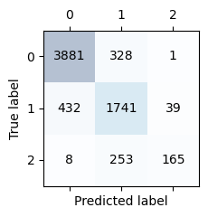

# Housepriceprediction

## Project description
This project consists of a classification task.\
The task is to predict which of 3 price classes a property in the city belongs to.

The dataset for this project consists of property data from Melbourne.\
The features are a mix of continuous and categorical variables.\
The target feature is unbalanced, so using macro f1 score as the training metric is the natural choice. However, when training the models it became apparent that using accuracy as training metric gave better results. 

## Results
After training multiple classification models on the dataset, both with outliers removed and on with outliers left in the dataset, our best performing model was random forest classifier trained on the dataset with outliers removed. \
Using this model gave us an accuracy of 0.84. \
Looking at the confusion matrix (below), we observe that model is poor at classifying observations belonging to class 2, while it is doing a better job at classifying class 0 and class 1.

